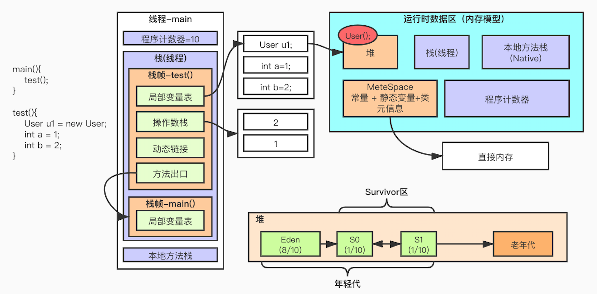

# JVM

## JVM内存模型



- 堆内存：
  - 年轻代：对象首先在Eden区完成分配，YGC后将Eden区存活的对象和S0或S1存活的对象，拷贝到另外一个区。各种GC回收器在这里都是使用的 **标记-复制** 算法
  - 年老代：经过15次YGC仍然存活或者在年轻代无法分配的对象，存放在年老代。年老代的垃圾回收没有年轻代频繁，FGC时回收。
- 栈内存：表示的是线程栈内存，局部变量、基本数据类型在栈内存上分配
  - 局部变量表：维持线程内方法的局部变量信息
  - 操作数栈：可以理解为计算区域
  - 方法出口：在方法嵌套调用时，需要知道当前方法执行完以后，跳回到哪里，和程序计数器配合使用
- 本地方法栈：Native方法的栈内存空间
- 程序计数器：方法嵌套调用时，总要只要当前方法执行到哪里，子函数完成后要跳转回来
- MetaSpace元空间：
  - Class类元信息：通过ClassLoader加载的类、动态代理生成的代理类信息
  - 常量
  - 静态变量

## Java对象内存分配策略
- 对象优先在Eden区进行分配：大多数情况下，对象在新生代的Eden区进行分配。当Eden区空间不足时，触发YGC
  - YGC后再次尝试在Eden区分配对象，如果仍无法分配，尝试在年老代分配对象
  - 年老代没有足够连续的空间分配对象，触发FGC(不绝对会触发YGC)后，再次尝试分配对象
  - 在FGC后仍然没有足够连续空间分配对象，退化成Serial Old GC基于 **标记-整理** 算法进行回收整理，再次分配对象
  - 如果全部分配失败，抛出 ```OutOfMemory``` 异常，JVM宕机应用不在提供服务
- 大对象直接在年老代进行分配：连续的数组、非常大的字符串。
  - 可以通过```-XX:PretenureSizeThreshold```指定大对象的阈值
  - 指定大对象也是有意义的，可以在一定程度上避免大对象在YGC时频繁的复制；但是，也会带来问题，大对象占用年老代空间，根据Java对象朝生夕死的特点，很久才会被FGC清除
- 长期存活的对象进入年老代：可以理解为被15次YGC后仍然存活的对象可以直接进入年老代
  - 可以通过```-XX:MaxTenuringThreshold```指定长期存活的阈值
  - 如果设置较小，会导致新对象过早的进入到年老代；而设置过大，会让本应该进入年老代存活的对象在YGC时频繁的复制

> MinorGC(YGC): 年轻代GC，因为Java对象具大多具备朝生夕死的特性，所以YGC会非常频繁，回收速度比较快
>
> MajorGC(FGC): 年老代GC，当出现FGC时，经常至少会伴随一次YGC(不绝对)。FGC的速度一般比YGC慢10倍以上。
>
> 要尽量减少系统FGC的频率,这也是我们做JVM调优的目标

## GC垃圾回收